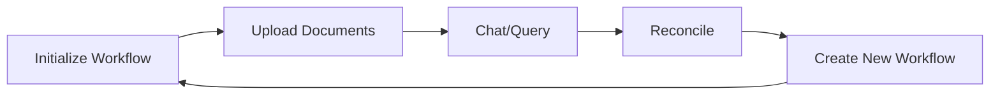

# Workflow Initialization API Documentation

## Endpoint: Initialize Workflow
**URL**: `/v1/workflow/init`  
**Method**: `POST`  
**Description**: 
Create a new workflow session with a unique identifier. Each workflow represents an isolated workspace for document processing and chat interactions. All documents and chat history are scoped to the workflow ID.

### Purpose
- Generate unique workflow session IDs
- Initialize database records for the workflow
- Enable isolated document storage per session
- Support multi-tenant document management

### Workflow Concept

A **workflow** is an isolated session that contains:
- Uploaded documents (invoices, receipts, statements)
- Vector embeddings in Pinecone (namespaced by workflow_id)
- Chat conversation history
- Reconciliation results

**Key Benefits:**
- **Isolation**: Documents from different workflows never mix
- **Organization**: Group related documents by project/client/period
- **Multi-User**: Different users can have separate workflows
- **Session Management**: Create new workflows for different tasks

### Request

**Method**: `POST`  
**URL**: `/v1/workflow/init`  
**Body**: None (no parameters required)

### Responses

#### Success Response (200 OK)
**Content-Type**: `application/json`

```json
{
  "workflow_id": "7a3f2c1e-9b4d-4e8a-a5f6-1c2d3e4f5a6b",
  "message": "Workflow initialized."
}
```

**Response Fields:**
- `workflow_id`: UUID v4 string (unique identifier)
- `message`: Confirmation message

#### Error Responses
- **500 Internal Server Error**: Database connection failed or workflow creation error

### Example Usage

#### Python
```python
import requests

url = "http://localhost:8000/v1/workflow/init"
response = requests.post(url)
data = response.json()

workflow_id = data['workflow_id']
print(f"Created workflow: {workflow_id}")

# Use this workflow_id for subsequent operations
```

#### cURL
```bash
curl -X POST "http://localhost:8000/v1/workflow/init"
```

#### JavaScript
```javascript
const response = await fetch('http://localhost:8000/v1/workflow/init', {
  method: 'POST'
});

const data = await response.json();
const workflowId = data.workflow_id;
console.log(`Workflow ID: ${workflowId}`);

// Store in localStorage for session persistence
localStorage.setItem('workflow_id', workflowId);
```

### Workflow Lifecycle



1. **Initialize** - Create workflow with `/workflow/init`
2. **Ingest** - Upload documents with `/ingest`
3. **Chat** - Query documents with `/chat`
4. **Reconcile** - Run reconciliation with `/reconcile`
5. **Repeat** - Create new workflow for next project

### Database Schema

When a workflow is initialized, a record is created in the `workflows` table:

```sql
CREATE TABLE workflows (
  id UUID PRIMARY KEY,
  status VARCHAR DEFAULT 'active',
  created_at TIMESTAMP DEFAULT NOW()
);
```

### Best Practices

1. **One Workflow Per Project**
   - Use separate workflows for different clients
   - Create new workflow for each accounting period
   - Don't mix unrelated documents in one workflow

2. **Session Management**
   - Store `workflow_id` in client-side storage (localStorage)
   - Display workflow ID to users for reference
   - Provide "New Session" button to create fresh workflows

3. **Naming Convention** (Client-Side)
   - While the API doesn't support naming, your frontend can:
   - Map workflow IDs to friendly names
   - Store metadata (client name, date range, purpose)
   - Example: `{"id": "7a3f2c1e...", "name": "Client ABC - Q1 2024"}`

4. **Cleanup**
   - Currently no API to delete workflows
   - Consider implementing archival logic
   - Old workflows remain accessible indefinitely

### Integration Example

Complete workflow setup in a frontend application:

```javascript
// Initialize new session
async function createNewSession() {
  const response = await fetch('http://localhost:8000/v1/workflow/init', {
    method: 'POST'
  });
  const data = await response.json();
  
  // Store workflow ID
  localStorage.setItem('current_workflow', data.workflow_id);
  
  // Update UI
  document.getElementById('session-id').textContent = 
    data.workflow_id.substring(0, 8) + '...';
  
  // Clear previous chat
  clearChatHistory();
  
  return data.workflow_id;
}

// Use in application
const workflowId = await createNewSession();
console.log(`Ready to upload documents to workflow: ${workflowId}`);
```

### Security Considerations

- **No Authentication**: Currently no auth required to create workflows
- **Public Access**: Anyone with a workflow_id can access its documents
- **Future Enhancement**: Add user authentication and workflow ownership

### Limitations

- No way to list all workflows for a user
- No workflow deletion endpoint
- No workflow metadata (name, description, tags)
- No workflow sharing/collaboration features

### Related Endpoints

After initializing a workflow, use these endpoints:
- [`/v1/ingest`](ingest_api.md) - Upload documents
- [`/v1/chat`](chat_api.md) - Query documents
- [`/v1/reconcile`](reconcile_api.md) - Run reconciliation
